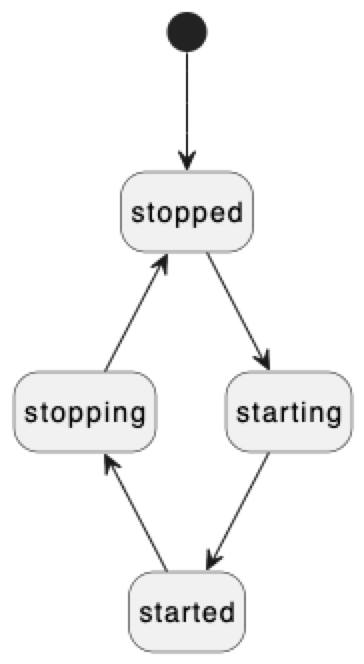

# ``Plugins``

A framework for managing units of functionality.

## Overview

This framework provides mechanisms for contributing and consuming functionality in
the form of _plugins_. The core idea is to facilitate loosely coupled software 
systems with good separation of concerns. 

> Note: This framework is loosely inspired by the plugin architecture of [Eclipse](https://aosabook.org/en/v1/eclipse.html).

### Plugins

Plugins are the basic units of functionality.

The functionality provided by a plugin is formalized trough its
_plugin interface_. Here's a simple example of a plugin interface:

```swift
protocol AdderPluginInterface: AnyObject {
    func add(lhs: Int, rhs: Int) -> Int
}
```

> Note: Plugin interfaces must be [class-only protocols](https://docs.swift.org/swift-book/documentation/the-swift-programming-language/protocols#Class-Only-Protocols).

The implementation of the plugin interface is provided by a corresponding _plugin object_:

```swift
final class AdderPluginObject: AdderPluginInterface, PluginLifecycle {
    
    // MARK: - AdderPluginInterface

    func add(lhs: Int, rhs: Int) -> Int {
        print("AdderPlugin > AdderPluginObject add(\(lhs), \(rhs))")
        return lhs + rhs
    }

    // MARK: - PluginLifecycle
    ...
}
```

> Note: Plugin objects should be cheap to create. In other words, they should not allocate
any resources or perform any significant operations on initialization. Any heavy lifting
should only occur during plugin startup (see plugin lifecycle below).

### The Plugin Lifecycle

Plugins are instantiated and prepared for use ("activated") only when needed. Regardless of 
the number of plugins registered in a system, initially there will be zero plugin objects in memory. 
In addition to being lazy-activated, plugins which are no longer needed are shut down, 
and their plugin objects deallocated.

This forms a simple _plugin lifecycle_:

<!---->


The plugin lifecycle is formalized by the ``PluginLifecycle`` protocol, which
plugin objects are required to adopt:

```swift
public enum PluginState {
    case stopped
    case starting
    case started
    case stopping
}

public protocol PluginLifecycle: AnyObject {
    
    var state: PluginState { get }

    func acquireDependencies(from: PluginRegistry) throws
    func releaseDependencies(in: PluginRegistry) throws
    
    func start() throws
    func stop() throws    
}
```

The plugin lifecycle is managed transparenly by _plugin handles_. But before we get to 
plugin handles, let's have a look at the _plugin registry_.

### The Plugin Registry

The plugin registry is the central registration and lookup facility for plugins. Plugins must 
be registered with the plugin registry before clients can use them, and handles to plugins 
can only be obtained from the plugin registry.

Plugins are registered by calling ``PluginRegistry/register(_:factory:)``, which takes
the plugin interface type (used throughout to identify plugins) and a factory 
closure that (lazily) creates the plugin object:
```swift
let registry = PluginRegistry()
...
try registry.register(AdderPluginInterface.self) {
    return AdderPluginObject()
}
```

The factory closure will be invoked whenever a new instance of the plugin object is needed. 
This will be handled transparently, i.e. hidden from clients.

In order to consume functionality provided by a plugin, clients need to look up the plugin 
(which is again identified by its plugin interface type) in the registry:
```swift
do {
    let pluginHandle = try registry.lookup(AdderPluginInterface.self)
    ...
} catch PluginError.notRegistered { }
```

If successful, the call to ``PluginRegistry/lookup(_:)`` returns a _plugin handle_.

### Plugin Handles

Plugin handles serve two purposes:

- They hide the concrete plugin object type from clients - clients only ever 
  interact with a plugin through its _plugin interface_.
- They transparently manage the plugin lifecycle. If a client wants to interact
  with a plugin, and the plugin has not yet been started, it will be
  started by the plugin handle before a client can use it.

> Note: 
There's a one-to-one relation between plugins and plugin handles, meaning that 
there exists at most one plugin handle per plugin. Multiple clients looking up 
the same plugin will receive a reference to the same plugin handle instance.

Looking up a plugin handle is a lightweight operation, i.e., this will not have 
any side effects on the plugin lifecycle. To actually trigger plugin
startup, clients need to ``PluginHandle/acquire()`` a reference to the plugin
interface. Only at this point will the plugin be started if it's in the 
stopped state. 

If plugin startup has been successful, clients can then consume the services
provided by the plugin through the plugin interface.

Similar to lazy plugin activation, plugins that are no longer in use (i.e., no longer 
referenced by any clients) will be shut down automatically to conserve resources. 
When a client is done using a plugin, it is expected to call ``PluginHandle/release()``
to relinquish the plugin interface. ``PluginHandle/acquire()`` and ``PluginHandle/release()``
will increment and decrement, respectively, an internal usage count.
When this usage count reaches zero, the plugin will be stopped, and any associated
resources will be released. The plugin handle will stay valid, though. On the
next call to ``PluginHandle/acquire()``, the plugin will be started again.
