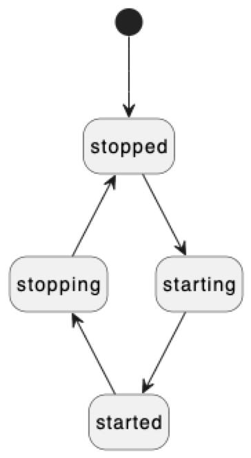

# ``Plugins``

A framework for managing units of functionality.

## Overview

This framework provides facilities for registering and consuming functionality provided
by so-called _plugins_.

### Plugins

Plugins are the basic units of functionality (think: "separation of concerns").

The functionality provided by a plugin is formalized trough its
_plugin interface_. Here's a simple example of a plugin interface:

```swift
protocol AdderInterface {
    func add(lhs: Int, rhs: Int) -> Int
}
```

The implementation of the plugin interface is provided by a corresponding _plugin object_:

```swift
final class AdderObject: AdderInterface, PluginLifecycle {
    
    // MARK: AdderInterface

    func add(lhs: Int, rhs: Int) -> Int {
        return lhs + rhs
    }

    // MARK: PluginLifecycle

    ...
}
```

### The Plugin Lifecycle

Plugins are instantiated and prepared for use only when needed. So, regardless of the number of 
plugins registered in a system, initially there will be zero plugin objects in memory. 
In addition to being lazy-instantiated, plugins which are no longer needed are shut down, 
and their plugin objects deallocated.

This forms a simple _plugin lifecycle_:

<!---->


Plugin objects are required to conform to the ``PluginLifecycle`` protocol:
```swift
public protocol PluginLifecycle {
    
    var state: PluginState { get }
    
    func start() /*async*/ throws
    func stop() /*async*/ throws
}
```

The plugin lifecycle is managed transparenly by _plugin handles_. But before we get to 
plugin handles, let's have a look at the _plugin registry_.

### The Plugin Registry

The plugin registry is the central registration and lookup point for plugins. Plugins must 
be registered with the plugin registry before client code can use them.

Plugins are registered by calling ``PluginRegistry/register(factory:for:)``, which takes
a factory closure that (lazily) creates the plugin object when needed, and the plugin 
interface type, which is used to identify plugins:
```swift
let registry = PluginRegistry()
...
try registry.register(factory: {
    return AdderObject()
}, for: AdderInterface.self)
```

The factory closure will be invoked whenever a new instance of the plugin object is needed. 
This will be handled transparently (i.e., not visible to clients).

In order to consume the functionality provided by a certain plugin, clients need to look
up the plugin (again identified by the plugin interface type) in the registry:
```swift
do {
    let pluginHandle = try registry.lookup(AdderInterface.self)
} catch PluginError.notRegistered { }
```

If successful, the call to ``PluginRegistry/lookup(_:)`` returns a _plugin handle_.

### Plugin Handles

Plugin handles serve two purposes:

- They hide the concrete plugin object type from clients - clients only ever 
  interact with a plugin through the _plugin interface_.
- They handle the plugin lifecycle. If a client wants to interact
  with a plugin, and the plugin is not yet in the started state, it will be
  transparently started by the plugin handle before it can be used by a client.

## Topics
